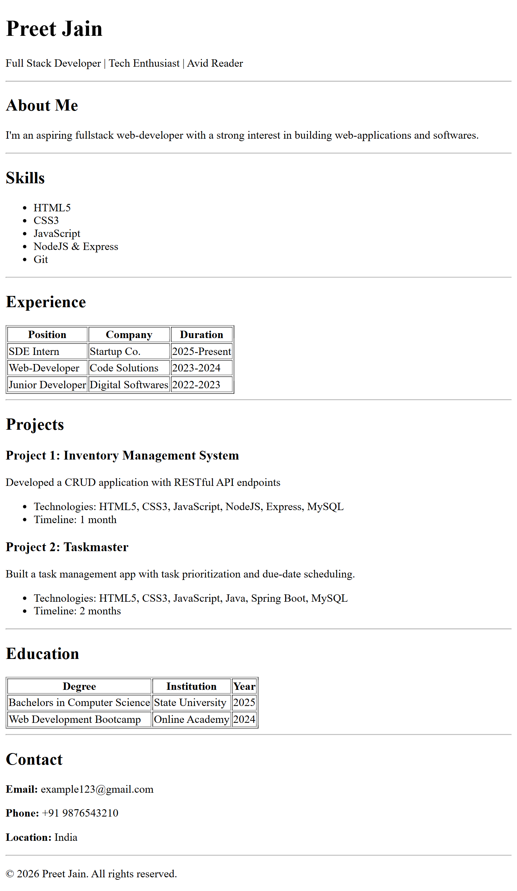

# My Resume Website

This is an example resume website created entirely using HTML.

## Live Demo
You can view the live site here: **[Click to View Resume](https://preetmax85.github.io/webdev-cohort-2026/)**

## 📸 Screenshot


## 🛠️ Setup Steps
If you want to run this project locally on your machine:

1. **Clone the repository:**
```bash
   git clone https://github.com/PreetMax85/webdev-cohort-2026
```

2. **Open the project:**  
   Navigate to the project folder and open `index.html` in any web browser.